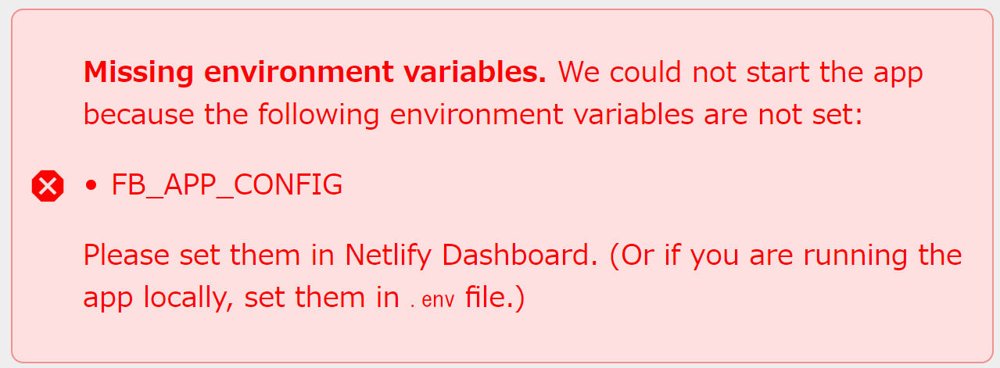

# Installation

To deploy your own UTRAD Werewolf server, follow these steps.

:::caution

Before you begin, be aware that this is a platform to support AIWolf researches. We do not offer sophisticated user management features like a full-fledged SNS or game app do. It is not intended to efficiently manage more than 100 users. User profile, including user names, cannot be private. Therefore, you must limit your use to a closed research group. **Do not make the URL available to the general public**.

Once your research is complete, it is recommended that the site itself be shut down in the Netlify console or that Authentication be turned off in the Firebase console. This will make it impossible for existing users to re-log in or for new users to sign up.

:::

## Prerequisites

This is a web-based project, but our docs do not assume you have any prior knowledge of web technologies, including JavaScript and HTML. Just follow the steps below and you should be able to get things working! However, we _do_ assume the following:

- You have basic knowledge of **Git** and **GitHub**.
- You have a valid **GitHub account**.
- You have a valid **Google account** (because we rely on Firebase).
- You can use a terminal (command line).

## Services We Depend on

In order to make it easy for everyone to set up a system that involves secure user authentication and realtime communication, we rely on several well-known services:

- [**Netlify**](https://netlify.com/): This is a web hosting service that allows for the "push and deploy" experience.
- [**Firebase**](https://firebase.google.com/): This is a BaaS (Backend-as-a-Service) managed by Google. We use this service to take care of user management, user authentication and database (Firebase [Realtime Database](https://firebase.google.com/docs/database)).

The use of these services is _typically_ free for a small research project. For example, Firebase's Spark plan allows you to hold up to 1GB of game log data (text) for free, which should generally be sufficient. Still, it is recommended to get an overview of what these services do and their pricing rules:

- [Netlify Pricing and Plans](https://www.netlify.com/pricing/)
- [Firebase Pricing](https://firebase.google.com/pricing)

## Mininum Deployment Steps

### 1. Deploy Your Site Using Netlify

Press the "Deploy to Netlify" button below, and follow the displayed instructions. If you're not a Netlify user yet, you need to sign up (you can use your GitHub account). You need to connect your GitHub account and Netlify. It automatically creates a fork of our "utrad-werewolf" repository into your GitHub account.

[](https://app.netlify.com/start/deploy?repository=https://github.com/smikitky/utrad-werewolf&base=packages/webapp)

After a successful deployment, you can open the deployed site by clicking the URL on the "Site overview" section of the dashboard. The URL should look like `https://<your-site-name>.netlify.app/`. In your browser, an error screen like this should appear:



This is expected for now because we have not set up our database (the place to store the actual game log data) yet. Our next step is to resolve this error.

:::note

You can change the URL (subdomain) of your site in the site's dashboard. If you like, you can also use a fully custom domain. If you want to customize the URL, it's recommended to do it here because Firebase will need that information (but you can change the settings later).

:::

### 2. Create and Configure a Firebase Project

This is the hardest part. If you're stuck, refer to the official Firebase tutorial, too.

- Visit [Firebase](https://firebase.google.com/) and sign in with your Google account.

- Create a new Firebase project. In this tutorial, we use `my-wolf` as the example project name. You don't need to enable Google Analytics.

- You will be instructed to create your first app. Create a "Web" app and give it a nickname such as `werewolf-web`. You will be instructed to install Firebase SDK, but you can skip this step (SDK is included in our repository). Proceed to the console.

- In the Firebase console, navigate to the Realtime Database section, and create a database. The default security rule should be "Locked".

  :::note
  **Do not use "Fire<u>store</u> Database"**. It's a different database solution, and we won't use it.
  :::

- Go to the "Realtime Databae &gt; Rules" tab, copy and paste the folloing security rules into the text box, and save them. This step is important; if you forgot to do this, an attacker can steal all the infromation stored in the database.

  ```json
  {
    "rules": {
      "games": { "$gameId": { ".read": true } },
      "userHistory": {
        "$uid": {
          ".read": "$uid === auth.uid || root.child('users').child(auth.uid).child('canBeGod').val() === true"
        }
      },
      "globalHistory": {
        ".read": "root.child('users').child(auth.uid).child('canBeGod').val() === true",
        ".indexOn": ["mark", "finishedAt"]
      },
      "users": {
        ".read": true,
        "$uid": {
          "onlineStatus": {
            ".write": "$uid === auth.uid || root.child('users').child(auth.uid).child('canBeGod').val() === true"
          },
          "ready": {
            ".write": "$uid === auth.uid || root.child('users').child(auth.uid).child('canBeGod').val() === true"
          }
        },
        ".indexOn": "canBeGod"
      }
    }
  }
  ```

- Set up user authentication providers. Go to the "Authentication" section and start it. Navigate to "Authentication &gt; Sign in method", and enable the following two log-in providers.

  - Google
  - Mail/Password: Enable "Email link (passwordless sign-in)" option

- Navigate to the "Project settings &gt; Overview" section. You can find the "App" you created before. And there you can see the `firebaseConfig` data that looks like this:

  ```js
  const firebaseConfig = {
    apiKey: "AIzaSyDOCAbC123dEf456GhI789jKl012-MnO",
    authDomain: "<your-project-id>.firebaseapp.com",
    databaseURL: "https://<your-database-name>.firebaseio.com",
    projectId: "my-wolf",
    appId: "1:xxxxxxx:web:xxxxxxxxxxxxxxxxxxx",
  };
  ```

  Copy the object part (between `{` and `}`), and save it as a **valid** JSON (JavaScript Object Notation) file.

  ```json title="appconfig.json"
  {
    "apiKey": "AIzaSyDOCAbC123dEf456GhI789jKl012-MnO",
    "authDomain": "<your-project-id>.firebaseapp.com",
    "databaseURL": "https://<your-database-name>.firebaseio.com",
    "projectId": "my-wolf",
    "appId": "1:xxxxxxx:web:xxxxxxxxxxxxxxxxxxx"
  }
  ```

  Then, encode this JSON file using base64.

  ```bash title="In your terminal"
  $ cat appconfig.json | base64 -w0 > appconfig-base64.txt
  ```

  The `base64` utility is available on Linux/Mac. If you're on Windows, Git Bash comes with the `base64` tool.

  :::caution
  The data to encode must be valid as JSON. For example, property names such as `appId` must be enclosed in double quotes. A modern editor like VSCode may fix obvious errors when you save a file with the `.json` extention. You can use any online JavaScript-to-JSON converter, too (this data is not a secret, anyway).
  :::

- In the Project settings section, open "Service account". Click "Generate New Private Key", and download a JSON file called `serviceAccountKey.json`. Use the `base64` tool again to encode this into a one-line string.

  ```bash title="In your terminal"
  $ cat serviceAccountKey.json | base64 -w0 > serviceAccountKey-base64.txt
  ```

- Finally, register these key data as Netlify's environment variables. Go to Netlify's dashboard, navigate to "Site configuration &gt; Environment variables", and add the following two environment variables:

  - `FB_APP_CONFIG`: The base64-encoded data of the app config object (`firebaseConfig`).
  - `GCP_CREDENTIALS`: The base64-encoded data of the service account key file.

<details>
<summary>What are these encoded data for?</summary>

- [The Firebase config object](https://firebase.google.com/docs/web/learn-more#config-object) (encoded as `FB_APP_CONFIG`) is an identity file that associates your web app (hosted by Netlify and running on browsers) and your Firebase project. This is a non-secret piece of data. This information is usually something you could write directly in JavaScript code and commit to Git, but we use an anvironment variable to make your own Firebase project available.
- [The service account key file](https://firebase.google.com/docs/admin/setup#initialize_the_sdk_in_non-google_environments) (encoded as `GCP_CREDENTIALS`) is essentially a "password file" with which Firebase grants full admin access to your Realtime Database (and other resources). It's used only by the _server_ backend you trust. Never share this with anyone.

</details>

- On the Netlify dashboard, re-run the deployment so that the new environment variables take effect. When the deployment succees, reopen the site URL. Congratulations, you should now see a log-in screen.

You can now close Firebase console and Netlify dashboard tabs on your browser.

### 3. Log In to the Werewolf Server and Become Admin

Sign-in to the app using your personal Google account. Go to the "Profile" page and change your user name to something other than "new user". **The first user who changed their user name on the profile screen** will be automatically granted an admin (aka "god") priviledge of the app. See "God Mode" menu will appear on the right of the top menu.

### 4. Start Your First Game

It takes 5 players to play a werewolf game, so let's create non-player character (NPC) accounts now.

## Updating

Your Netlify site is linked to the **fork** of our repository. To update the site, you can push new contents to your fork, and Netlify will re-deploy the site for you. If you just to want to update the app to the latest, the process will be something like this:

```bash
$ git remote add upstream https://github.com/smikitky/utrad-werewolf
$ git fetch upstream
$ git checkout main
$ git merge upstream/main
$ git push
```

## Run on Your Local Machine (Optional)

You can also run this app locally on your development machine. You still need Firebase Realtime Database account. You need some experience about Node.js, NPM and JavaScript.

- Make sure you have installed a recent version of Node.js on your machine. Windows users can simply use the installer available on the official site. If you're on Linux, it's usually easiest to use [NVM (Node Version Manager)](https://github.com/nvm-sh/nvm).

- Clone the `utrad-werewolf` repository, and do `cd utrad-werewolf/packages/webapp`. (This repository is a monorepo and the actual web UI is located here.)

- Configure environment variables. Make a new file named `.env` under `webapp`, and define required environment variables. Your `.env` file should look like this:

  ```env
  FB_APP_CONFIG="(base64-encoded string of your app config JSON)"
  GCP_CREDENTIALS="(base64-encoded string of your server key)"
  ```

- Run the following on a terminal. This will install all the dependencies and start a local web server.

  ```bash
  $ npm ci
  $ npm run dev
  ```

- Open a browser by clicking the shown link (which should look like `http://localhost:8888/`).
